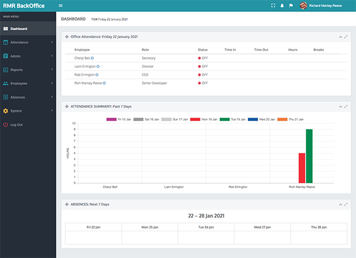
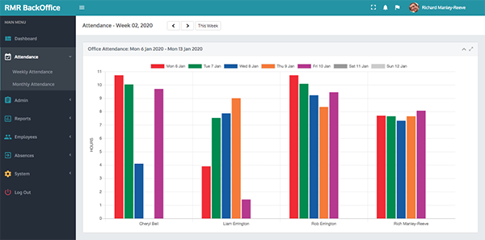
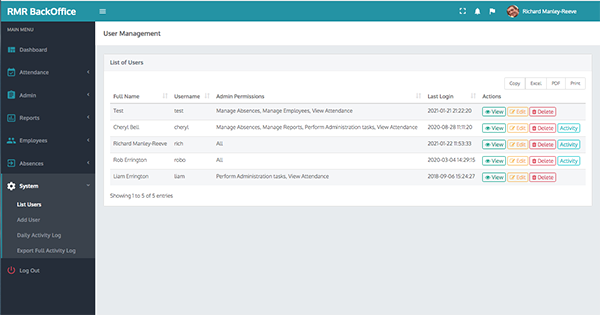

# laravel-office
 

Laravel port of SME office employee time management system

Backend originally developed on [F3](https://github.com/bcosca/fatfree)
UI is AdminBSB-Sensitive by @gurayyarar using Bootstrap 3 & jQuery.

Porting to Laravel 8 & building Docker image as part of a quick Laravel refresher.
Session-based authentication and user roles ported across to custom middleware. 
